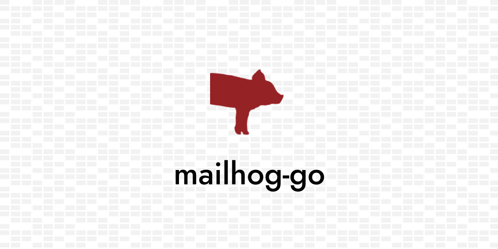

[](https://pkg.go.dev/github.com/rizalgowandy/mailhog-go?tab=doc)
[](https://github.com/rizalgowandy/mailhog-go/releases)
[](https://goreportcard.com/report/github.com/rizalgowandy/mailhog-go)
[](https://github.com/rizalgowandy/mailhog-go/actions?query=branch%3Amain)
[](https://sourcegraph.com/github.com/rizalgowandy/mailhog-go?badge)



## Getting Started

Interact with MailHog API.

## Installation

```shell
go get -v github.com/rizalgowandy/mailhog-go
```

## Quick Start

```go
package main

import (
	"log"
	"context"

	"github.com/rizalgowandy/mailhog-go"
	"github.com/rizalgowandy/mailhog-go/pkg/api"
)

func main() {
	cfg := api.Config{
		HostURL: MailHogContainer.UIEndpoint,
	}
	client, err := mailhog.NewClient(cfg)
	if err != nil {
		log.Fatal(err)
	}

	ctx := context.Background()
	messages, err := client.GetAllMessages(ctx)
	if err != nil {
		log.Fatal(err)
	}
}
```

For more example, check [here](test/smtp_test.go).

## Supported API

- GET /api/v2/messages
- GET /api/v1/messages/{id}
- DELETE /api/v1/messages
- DELETE /api/v1/messages/{id}
- GET /api/v2/search
